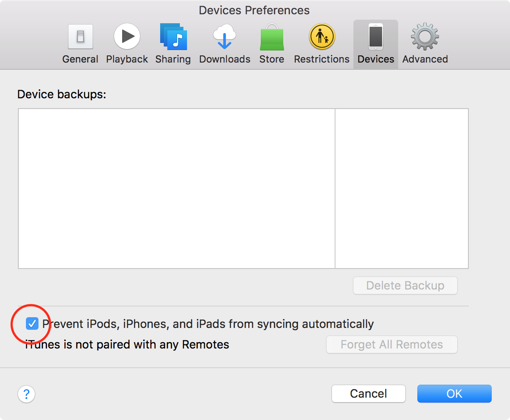

# The road to publish an app to the App Store 😣

This is a collection of loose things that I (we) learnt the hard way.  
Most of them are difficult to find, to understand and not obvious.

I hope to save some headache for other people who want to publish an app.

## Organization ❗️= Enterprise account

Apple differentiates three types of developer accounts for business (excluding education and MFi):

- Individuals
- Organizations
- Enterprise Program

The most important thing: **Enterprise accounts cannot publish in the App Store**. They can only distribute via In-house App Distribution.  
This means _BYOD_ (bring your own device) is impossible, if the customer should be able to download the app from the App Store.

#### More information

Apple has indeed a page that compares the different memberships. It's clearly stated, but not easy to find.
It's located here: https://developer.apple.com/support/compare-memberships/

## Debugging iOS applications

If you ever tried to debug the application on a real device, and not a simulator, I bet you've encountered the following error message:

> failed to get the task for process <xyz>

This error message simply means: don't use a distribution profile for debug signing.  
While this behavior is totally comprehensible, because the end-user shouldn't be able to debug your app, the error code is very misleading.

**The fix for this is: use a developer profile for debugging/signing.**

#### More information

If you google the error message, you end up visiting a page on Stack Overflow, where the answer has more than 630 upvotes. Maybe Apple can introduce a better error message in the future...  
You can find the question with the answer here: https://stackoverflow.com/q/11601304/1902598

## Difference between the seller and developer name.

There are two types of names the end user will see in the App Store.

1. The developer name
2. The seller name

**They can be different!**

### Seller name

The _seller_ name is the name of the legal entity that was registered as a developer. It's displayed in the detail page of the App Store as the _Developer_ in the _Information_ list. Confusing is that the seller name is displayed as the _developer_ in the _Information_ list. It used to be _Seller_ in the past, according to screenshots.

### Developer name

The _developer_ name can be customized **once**, when you initially create the **very first** app. It's displayed under the app name, right at the top in the search and the detail page.

#### More information

There is of course a Stack Overflow question with answer (here: https://stackoverflow.com/q/23738192/1902598) and the iTunes Connect Developer Guide has a page for _Identifying Your App in iTunes Connect_ here: https://developer.apple.com/library/content/documentation/LanguagesUtilities/Conceptual/iTunesConnect_Guide/Chapters/FirstSteps.html

## VPP requires a new Apple ID

You can't _upgrade_ or _enable_ an existing Apple ID for the VPP (Volume Purchase Program) in order to download purchased apps or receive custom B2B apps. It requires a new Apple ID. The best thing to do is: Let the VPP admin invite users. Then they create the correct type of Apple ID.

## iTunes Connect ❗️= Apple Developer membership

It's not enough to be part of the Apple Developer account. Being a member does not grant you access to iTunes Connect. **You need to be invited separately**, otherwise you receive the unobvious error message

> Your Apple ID isn't enabled for iTunes Connect. Learn More

after clicking the iTunes Connect button from the Developer Portal.

#### More information

The _Learn more_ link does not work. Don't bother following it.  
Instead the solution is stated on Stack Overflow, as always: https://stackoverflow.com/q/28867975/1902598

## Building and signing with one account but uploading to another account

While we were granted access to the customers organization account, I cannot tell you if it's possible to build/sign the app via the _account A_, but upload it with the customer's _account b_. If you know more, please tell me - I'm eager to know.

## VPP requires a "Paid Applications contract"

Even if you don't plan to charge money for your app, a B2B app requires that you (correctly: the iTunes Connect admin) has signed a so called _Paid Applications contract_, where you need to fill in a lot of legal information and a bank connection where potential money should be paid to. Be prepared to ask your legal department a lot of information!

## You can't delete apps from iTunes Connect

Once a, we called it internally, _App skeleton_ has been created, you cannot remove it from the iTunes connect store, but only remove it from sale later. Be careful to not produce too much junk!

## Launching an app from Xcode to a newer iOS version

This is not possible. It requires a Xcode version which supports this iOS Version.  
This means that you need to update your Xcode installation or install the current Xcode beta, too.  
Have fun downloading >5GB again!

## iTunes opens every time a device is connected

This feature can be very annoying. Every time you attach a device via cable the iTunes process hijacks the window.  
Luckily this can be disabled in iTunes. Follow these steps:

> Open iTunes -> Preferences -> Devices -> Check "Prevent iPods, iPhones, and iPads from syncing automatically"

## App installation failed even though it should succeed

When you hit the play button and made changes to the app (e.g. changed the _Bundle Identifier_, you might be greeted by the following error message:

> App installation failed

> This application's application-identifier entitlement does not match that of the installed application. These values must match for an upgrade to be allowed.

It seems like Xcode is not picking up the changed _Display Name_ nor _Bundle Identifier_ sometimes.  
Solution: Click into the text fields and maybe add a space and remove it again, i.e. refresh the field. Then hit the play button again.

## The organizer disappeared!

When you accidentally close the _Organizer_ (the window that opens once you _archived_ your app in order to upload it to iTunes Connect) you might find yourself searching for it.  
Luckily you can easily open it again:

> Window -> Organizer

## iTunes Connect refuses apps that are uploaded from Xcode Beta versions

While you might need a Beta of Xcode in order to deploy to iOS Beta devices, the thumb rule is: **never deploy with a Xcode Beta to iTunes Connect!**

Otherwise you will be greeted by an error message like this:

> New apps and app updates must be built with the public (GM) versions of Xcode 6 or later, macOS, and iOS SDK. Don't submit apps built with beta software including beta macOS builds.
> Invalid sdk value. The value provided for the sdk portion of LC_VERSION_MIN_IPHONEOS in MyApp.app/MyApp is 11.1 which is greater than the maximum allowed value of 11.0.

## Using encryption and the legal implications

We decided to add encryption (via WebCrypto, but under the hood it uses WebKit/Apple's _standard_ method for encryption and decryption). When deploying a new update via iTunes Connect, there is this little radio button with a text like this _have you recently added or made changes to the encryption functionality of the app?_  
Um, yes, we have. **This is where the fun party begins!** Since technically every download of an app from the App Store is an export from the U.S. and encryption is considered a weapon (see [Wikipedia for more information](https://en.wikipedia.org/wiki/Export_of_cryptography_from_the_United_States)), you need to meet the export compliance of the U.S. _Bureau of Industry and Security_ (BIS). This means you need to fill out a _Self Classification Report_ and mail it to the BIS and **yes** a NSA e-mail address. Holy cow, what is going on in the U.S.?  
In the end we decided that our customer has to fill out the report, since the iTunes Connect entity is their legal business entity.  
Nevertheless you just need to e-mail a CSV with one line to the BIS and NSA - this is doable :)

You might find these links interesting and helpful regarding the BIS report:

- https://help.apple.com/itunes-connect/developer/#/devc3f64248f
- https://www.bis.doc.gov/index.php/policy-guidance/encryption/4-reports-and-reviews/a-annual-self-classification (especially the sample report at the bottom!)
- http://simonfairbairn.com/bis-year-end-self-classification-report/
- https://www.ecfr.gov/cgi-bin/retrieveECFR?gp=1&SID=4150cfbf028e9a85574385383a581f47&h=L&mc=true&n=pt15.2.742&r=PART&ty=HTML#ap15.2.742_119.6

Fun fact (and :wave: @S2 Swipe! ;)) - our specialized mobile app development agency has never filled out this report. Still doubt that you made every app without any encryption feature(s), but this is not my :beer:

## B2B Apps are broken in multiple ways

In 2019 Apple rejected our app update due to violating the App Store Review Guideline [3.2 Other Business Model Issues](https://developer.apple.com/app-store/review/guidelines/#other-business-model-issues). They've said that our app is a custom B2B app and is not suited for the general App Store. Our complaint that other companies such as [Uber Driver](https://apps.apple.com/us/app/uber-driver/id1131342792), [MOIA Operations](https://apps.apple.com/de/app/moia-driver-f%C3%BCr-fahrer/id1353379863) and many others offer apps without a registration was rejected.  
Feels pretty bad, simply because we were not "big enough" so they could pull this move - but others were allowed and remained in the store event after I've reported them.

After switching to the Business Manager and providing the app via invite codes, the following App Store bugs are present and not fixed in >1 year:

1. The App description, although required to be filled in, won't be displayed - it just shows the "Can't connect to the App Store".
2. Updates are not shown if the app is downloaded via family sharing.
3. You can't deeplink via `itms-apps://itunes.apple.com/app/id12345` - it just shows that it's not available in your region.
4. There is no way to view the app in full screen, only the popover window works.
